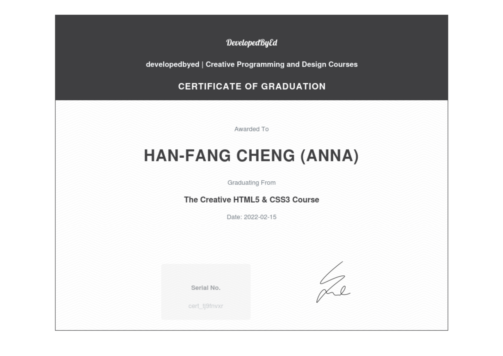

# annac-travelly

## Original Design from DEV ED

**Visit the website:**[origin-travelly.netlify.app](https://origin-travelly.netlify.app/)

**Ingredients:**

* HTML
* Plain CSS

## Modified Version by ME

**Visit the website:** [melbourne-travelly.netlify.app](https://melbourne-travelly.netlify.app)

**Ingredients:**

* HTML
* SASS (SCSS) -> to make the code cleaner
* Introduction of Melbourne's art, coffee and nature.

## Course Introduction

This is a simple travel website design based on HTML&CSS and built from strach. I learnt from DEV ED (a web developer on Youtube). It was a interesting course based on project learning. We also created other two project. Please take a look of them. 😀

* [photography](https://github.com/anna0625/annac-photography)
* [portfolio](https://github.com/anna0625/annac-portfolio)

## Certificate

